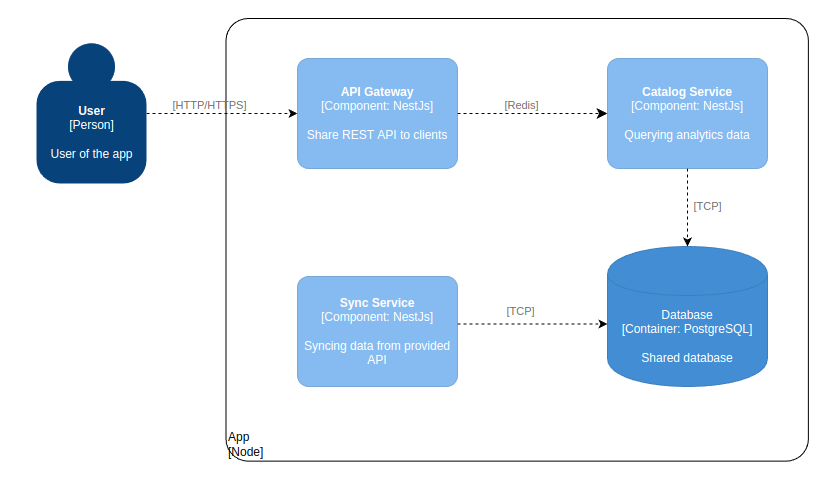

# Project

## Start the app
Run this commands to build and run the app.
```
npm ci
npx nx run-many --target=build --all=true --parallel=true
docker-compose up --build
```
`sync-service` need a couple of minutes to sync with the data API and populate the database.
Swagger UI will be available at `http://localhost:3000/api`.

## Architecture



This project was generated using [Nx](https://nx.dev).
